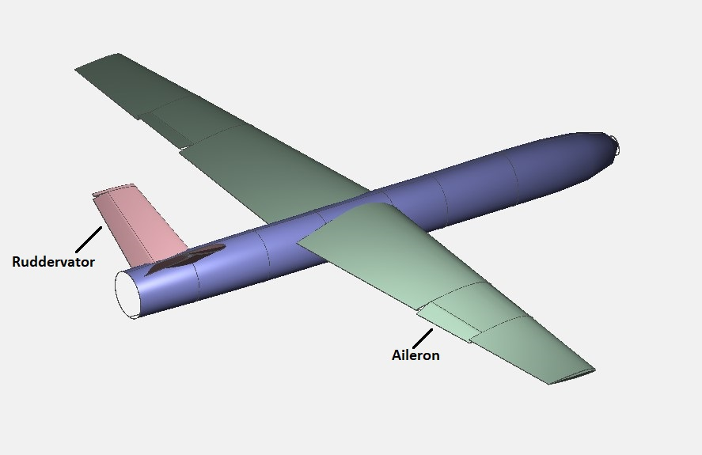

# SAMAD Unmanned Aerial Vehicle Control Surfaces Sizing and Design



## Overview

This repository contains code and resources for sizing and designing the control surfaces (Aileron, Rudder, and Elevator) for the conventional Unmanned Aerial Vehicle (UAV) named SAMAD. The control surfaces are essential components of the UAV's flight control system, enabling stability, maneuverability, and control authority during flight.

## Features

- **Aileron Sizing and Design**: Algorithms and tools for determining the optimal size, shape, and placement of ailerons to achieve desired roll control.
- **Rudder Sizing and Design**: Methods for sizing and designing the rudder to provide yaw stability and control.
- **Elevator Sizing and Design**: Techniques for sizing and designing the elevator to control pitch and maintain stability.

## Getting Started

- **MATLAB**: Use either an installed version or the MATLAB online platform.

### Installation

1. Clone the repository to your local machine:

    ```bash
    git clone https://github.com/Malik-Nauman-Rauf-207/SAMAD_Control_Sizing.git
    ```

2. Navigate to the project directory:

    ```bash
    cd SAMAD_Control_Sizing
    ```

### Usage

$ Run the aileron sizing script:

    Aileron_Sizing_2.m
   
$ Run the Elevator sizing script:

    Elevator_Sizing.m

$ Run the Elevator sizing script:

    Rudder_Sizing.m


## Contributing

Contributions to this project are welcome and encouraged. If you'd like to contribute, please follow these steps:

1. Fork the repository.
2. Create a new branch (`git checkout -b feature/yourfeature`).
3. Make your changes.
4. Commit your changes (`git commit -am 'Add new feature'`).
5. Push to the branch (`git push origin feature/yourfeature`).
6. Create a new pull request.


## Contact

For questions or inquiries about the SAMAD UAV Control Surfaces Sizing and Design project, please contact naumanrauf.hanx@gmail.com.


